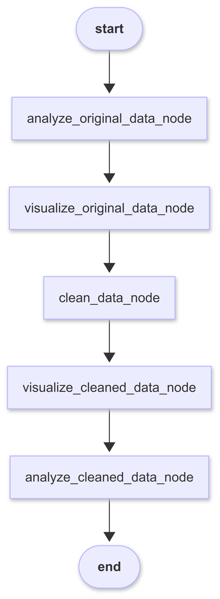

# IntelliWiz: AI-Powered Data Analysis Platform

IntelliWiz is a smart platform that automates data cleaning and visualizations using AI agents. It helps data analysts save time by automating the most tedious parts of data analysis.

## Problem Statement

- 80% of a data analyst's time is spent on data cleaning, preparation, and exploratory data analysis
- Manual data cleaning is tedious, error-prone, and doesn't scale
- Existing tools often require manual intervention at multiple stages

## Solution

IntelliWiz leverages AI agents to automate:
- Data profiling and analysis
- Intelligent data cleaning and preprocessing
- Visualization selection and generation
- Before/after comparisons of cleaned data

## 🔗 Live Demo

- Main Application: [https://intelliwiz.streamlit.app/](https://intelliwiz.streamlit.app/)
- Report Application: [https://intelliwiz-report.streamlit.app/](https://intelliwiz-report.streamlit.app/)

## 🔍 Features

- **AI-powered data cleaning** - Automatically handles missing values, outliers, and data type issues
- **Intelligent visualization generation** - Creates relevant visualizations based on dataset characteristics
- **Comparative analysis** - Shows before/after cleaning analysis to understand data quality improvements
- **Debug mode** - Provides detailed logs and insights into the AI decision-making process

## 🛠️ Technologies Used

- **Frontend:** Streamlit (Python)
- **Data Processing:** Pandas, NumPy
- **AI Integration:** Llama API (Llama 3.1)
- **Visualization:** Plotly Express, Graph Objects
- **Workflow Orchestration:** LangGraph

## 📋 Components

- **VisualizationAgent**: Creates meaningful visualizations from dataframes
- **DataCleaningAgent**: Handles data preprocessing including missing values, outliers, type conversion
- **AnalysisAgent**: Prepares comprehensive prompts for data analysis
- **LangGraph Workflow**: Orchestrates the entire process in a defined sequence

## 🚀 Installation

1. Clone the repository:
```bash
git clone https://github.com/BVishal-Geek/IntelliWiz.git
cd IntelliWiz
```

2. Install dependencies:
```bash
pip install -r requirements.txt
```

3. Run the application:
```bash
streamlit run app.py
```

4. Enter your Llama API key in the application interface when prompted

## 💡 How It Works

1. **Data Ingestion**: Upload CSV files via drag-and-drop
2. **Original Data Analysis**: AI agents profile and analyze the original data
3. **Original Data Visualization**: AI selects and creates appropriate visualizations
4. **Data Cleaning**: AI identifies and fixes data quality issues
5. **Cleaned Data Analysis and Visualization**: AI analyzes and visualizes the improved data
6. **Comparative Analysis**: Compare before/after results to see improvements

## 📊 Workflow Architecture

The application uses LangGraph to orchestrate the workflow:
<br>
<br>


1. `analyze_original_data_node` - Run AI-powered analysis on the original dataset
2. `visualize_original_data_node` - Create visualizations based on original dataset
3. `clean_data_node` - Clean the dataset using AI-powered data cleaning
4. `visualize_cleaned_data_node` - Create visualizations for cleaned dataset
5. `analyze_cleaned_data_node` - Run AI-powered analysis on cleaned dataset

## 🔮 Future Extensions

- **Human-in-the-Loop**: Implement feedback mechanisms allowing users to validate, correct, and refine AI-driven decisions
- **Memory-Enhanced Workflow**: Add persistent memory capabilities to retain context across sessions
- **LLM-Agnostic Architecture**: Refactor the system to work with multiple LLM providers
- **Agentic AI for Data Engineering and ML Modeling**: Develop specialized AI agents for more advanced tasks

## 👨‍💻 Contributors

- Yash Kattimani
- Swathi Murali Srinivasan
- Vishal Bakshi

## 📝 Repository

GitHub: [https://github.com/BVishal-Geek/IntelliWiz](https://github.com/BVishal-Geek/IntelliWiz)

---

*Note: This project requires a Llama API key to function. You'll need to enter your API key in the application interface after launching the app.*
